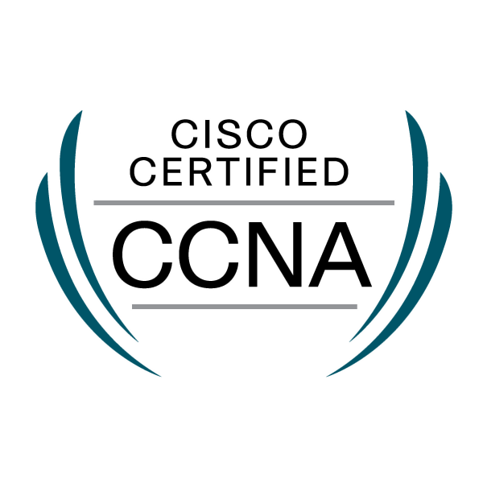

  
  

<h1 align="center">Aavash Devkota</h1>

<i>System Engineer @ Infrasoft Solutions · Security Enthusiast · Building CVEGuard & DomainWatch</i>

  <a href="mailto:devkotaaavash@gmail.com">email</a> ·
  <a href="https://linkedin.com/in/aavash-devkota">LinkedIn</a> ·
  <a href="https://github.com/aavash-devkota">GitHub</a>

---

## 🎓 Background

- B.Sc. CSIT, Tribhuvan University (2020–2024)

## 🏅 Certifications

  
  

<b>PCNSP</b> · Palo Alto Certified Network Security Professional &nbsp;|&nbsp; <b>CCNA</b> · Routing & Switching

  
  &nbsp;&nbsp;
  

## 🔬 Interests

Vulnerability analysis of complex software systems; supply-chain exposure assessment; domain & email security; infrastructure monitoring.

## 📦 Projects

### 🛡️ CVEGuard — Centralized Vulnerability Management
Supply-chain vulnerability analysis platform (solo final-year project).

- **Stack:** Go · PHP (Laravel 11) · MySQL · OSV/GHSA format
- **Scale:** ~430 MB upstream advisory DB → 7,040 npm vulnerabilities / 3,136 packages seeded in under a minute
- Three-component system: Go CLI lockfile scanner, Go GHSA seeder, Laravel server with semantic-version range matching

| Component | Stack | What it does |
|---|---|---|
| [cveguard-server](https://github.com/aavash-devkota/cveguard-server) | Laravel / PHP | Web UI + API |
| [cveguard-client](https://github.com/aavash-devkota/cveguard-client) | Go | package-lock scanner CLI |
| [cveguard-vulnerabilities-seeder](https://github.com/aavash-devkota/cveguard-vulnerabilities-seeder) | Go | CVE data seeder |

> 📄 Project report: https://aavash-devkota.github.io/cveguard-server/project-report/

### 🔭 DomainWatch — Domain Intelligence & Monitoring
UptimeRobot-for-domains: availability, price, expiration, DNS and security monitoring.
CLI + FastAPI + web dashboard + Prometheus metrics + Docker.

- [DomainWatch](https://github.com/aavash-devkota/DomainWatch) · Docs: https://aavash-devkota.github.io/DomainWatch/

## 🧰 Skills

  
  
  
  
  
  

  
  
  
  
  

  
  
  
  
  

  
  
  
  
  
  

---

  
  

